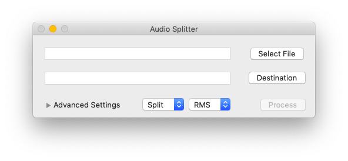
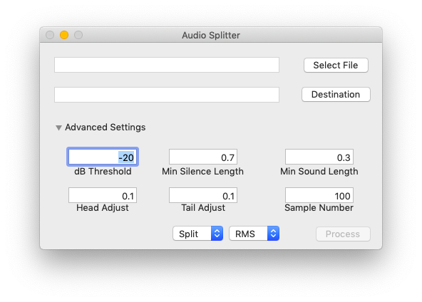

# AudioSplitter

Split files based on silence in a given clip.

## Basic Usage
Select a file using "Select File" and a destination folder using "Destination". Click "Process" and individual audio clips will be split out and saved to the destination folder. Note: FFMPEG must be installed when using Split or Trim.

## Extra Options
Output options include Split, Trim, and XML

### Output Type

#### Split
Split will create individual clips for every sound timing found.

#### Trim
Trim treats the input file as a single asset and outputs a single file with silence trimmed from only the beginning and end.

#### XML (WIP)
XML will output a FCP7 compatible XML file to be imported into audio or video applications. The XML media refer back to the original input file and creates no extra audio clips.

### Sound Detection Strategy

#### RMS
Use Root Mean Square for sound detection when comparing to dB Threshold.

#### Peak
Use waveform peaks (averaged over the number of samples) when comparing to dB Threshold.

## Advanced options
Several options are available to tweak audio parameters based on the input characteristics.

#### dB Threshold
Any sample dB value under this number will be considered silence.

#### Min Silence Length
The minimum length in seconds before a clip can be split.

#### Min Silence Length
The minimum length of silence (in seconds) before a clip can be split.

#### Min Sound Length
The minimum length of sound (in seconds) before a clip can be split.

#### Head Adjust
The amount to adjust at the beginning of the clip from where sound was first detected.

#### Tail Adjust
The amount to adjust at the end of the clip from where sound was last detected.

#### Sample Number
The number of samples to average when detecting sound. Higher numbers will result in faster output but will be more prone to error.
